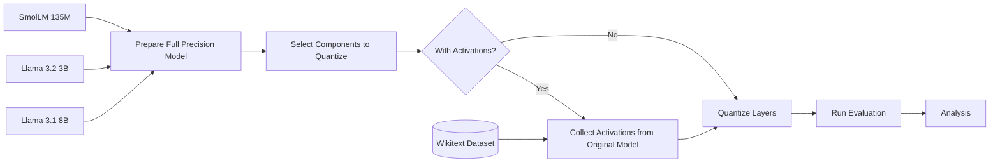

```mermaid
flowchart LR
    A[Prepare Full Precision Model] --> B[Select Components to Quantize]
    C[SmolLM 135M] --> A
    D[Llama 3.2 3B] --> A
    E[Llama 3.1 8B] --> A
    B --> F{With Activations?}
    F -->|Yes| G[Collect Activations from Original Model]
    I[(Wikitext Dataset)] --> G
    F -->|No| H[Quantize Layers]
    G --> H
    H --> J[Run Evaluation]
    J --> K[Analysis]
```
